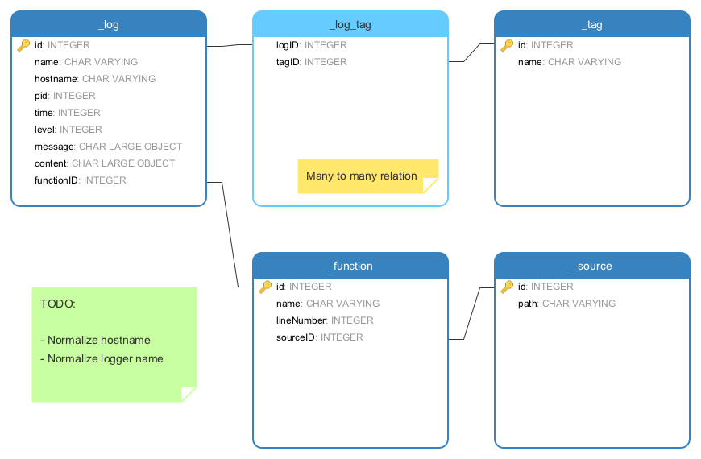

# dblogger

This implements a simple logging interface that is able to stream the log entries to a DB server or local sqlite files.

It reacts to `HUP` signals to reconnect/recreate the DB file, so simple logrotation is possible.

## Obtaining the package

Just install `dblogger` with `npm install --save dblogger`

## API

### Initialization

Initialize a named logger:

~~~javascript
const logger = require('dblogger')('default', {
	connection = {
		type: 'sqlite',
		dbPath: '/tmp/logger.db',
	}
});
~~~

To get access to an already initialized logger just skip the options object:

~~~javascript
const logger = require('dblogger')('default');
~~~

Available options in the options object:

- `level`: log level (optional, defaults to 'info')
- `src`: bool, log source position (optional, defaults to false)
- `connection`: db connection info
	- `type`: `sqlite`|`postgresql`|`mysql`|`mariadb`
	- `dbPath`: path to db file (required for sqlite, invalid for others)
	- `host`: db host (invalid for sqlite)
	- `database`: db name to use (invalid for sqlite)
	- `port`: port number for db server (optional, invalid for sqlite)
	- `username`: username for db server (optional, invalid for sqlite)
	- `password`: password for db server (optional, invalid for sqlite)
- `tablePrefix`: prefix for logging tables (optional, defaults to `logger`)

The underlying logger instance is a [Bunyan](https://github.com/trentm/node-bunyan) logger.

### Usage

The usage is basically identical to [Bunyan](https://github.com/trentm/node-bunyan), but here's a small overview:

#### Log something

~~~javascript
logger.trace('Message');
logger.debug('Message');
logger.info('Message');
logger.log('Message'); // same log level as info
logger.warn('Message');
logger.error('Message');
logger.fatal('Message');
~~~

If you log an exception a complete stacktrace will be saved in the content in addition to the usual saving of the message.

#### Set log level

You may set the log level on initialization or later by calling:

~~~javascript
// Fetch loglevel:
logger.level()

// Set loglevel:
logger.level('info');
~~~

#### Define tags for log entry

In addition to Bunyan's logging of objects as included fields you may use the tagging API:

~~~javascript
logger.tag('mytag', 'anothertag').log('Message');
~~~

All tags that are defined will be added to the returned logger instance. You could even do the following:

~~~javascript
const logger = require('dblogger')('default').tag('globaltag');

logger.log('Message'); // this message will be tagged with `globaltag`
~~~

#### Child loggers

In addition to creating global tags Bunyan has the concept of a child logger, which may add some information to all log entries:

~~~javascript
const child = logger.child({ somekey: 'somevalue' });

child.info('Message'); // this message will contain a key value pair of somekey: 'somevalue'
~~~

## DB Schema

## HTTP API

### Running the server

Example implementation:

~~~javascript
// import server and logger
const createServer = require('dblogger/api');
const createLogger = require('dblogger');

function server() {

	// create a logger, should be done in your app entry point
	// like index.js or app.js, for demo purposes we create it
	// right here
	const logger = createLogger('default', {
		connection: {
			type: 'sqlite',
			dbPath: '/tmp/logger.db',
		},
		src: true,
	}).then((l) => {
		// log something to serve via the API
		l.tag('example', 'server').info('Server started');
	});

	// create a server instance
	const s = createServer({
		// HTTP basic authentication credentials
		auth: {
			name: 'admin',
			pass: 'admin',
		},
		// Setup the page size, we set it to 10 here to
		// see if the pagination works correctly
		pageSize: 10,
		// allow queries without `logger` query param (assumes all loggers log to same file)
		combinedLogging: true,
	});

	// register the `default` logger with the API
	s.registerLogger('default');

	return s;
}

// run the server on port 3000
server().listen(3000);
~~~

This exact implementations is available in `tests/serve.js` so for demo purposes just run that file.

### API endpoints

Responses are encapsulated like this:

**Successful response:**

~~~json
{
  "next": null,
  "prev": null,
  "count": n,
  "results": [
    <item>,
	...
  ]
}
~~~

- `next`: a link to the next page if there is any (see `pageSize` setting of server)
- `prev`: a link to the previous page if there is one
- `count`: total number of results (may be bigger than the item count in `results`)
- `results`: array of result items

Pagination will always send the **newest items first**, so page zero is the most current.

**Failure response:**

~~~json
{
  "error": {
    "status": <status code>,
    "message": "<message>",
    "trace": [
		"<backtrace>",
		...
    ]
  }
}
~~~

- `error`: this toplevel item declares that an error occured (look at the HTTP status code too)
- `status`: HTTP status code repeated
- `message`: English error message
- `trace`: Array of backtrace lines (only if `NODE_ENV` is not `production`)

#### Available loggers

Endpoint: `/loggers`

Response items:

~~~json
{
  "id": <id>,
  "name": "<tag>"
},
~~~

Example:

~~~json
{
  "next": null,
  "prev": null,
  "count": 1,
  "results": [
	{
		"id": 1,
		"name": "default"
	}
  ]
}
~~~

This result will never be paginated.

#### Available tags

Endpoint: `/tags`

Available query filters:

- `logger` (string)

Response items:

~~~json
{
  "id": <id>,
  "name": "<tag>"
},
~~~

Example:

~~~json
{
  "next": null,
  "prev": null,
  "count": 2,
  "results": [
    {
      "id": 1,
      "name": "example"
    },
    {
      "id": 2,
      "name": "server"
    }
  ]
}
~~~

#### Available files

Endpoint: `/files`

Available query filters:

- `logger` (string)

Response items:

~~~json
{
  "id": <id>,
  "path": "<path to js file>"
}
~~~

Example:

~~~json
{
  "next": null,
  "prev": null,
  "count": 1,
  "results": [
    {
      "id": 1,
      "path": "/Users/johannes/Code/001-Anfema/kidswatch-logger-lib/tests/serve.js"
    }
  ]
}
~~~

#### Logfile time range

Endpoint: `/timerange`

Available query filters:

- `logger` (string)

Response item:

~~~json
{
  "from": "<iso date>",
  "to": "<iso date>"
}
~~~

This response only has one entry. The serializer just puts it into an array for consistency.

Example:

~~~json
{
  "next": null,
  "prev": null,
  "count": 1,
  "results": [
    {
      "from": "2016-10-17T13:38:57.201Z",
      "to": "2016-10-17T14:25:57.941Z"
    }
  ]
}
~~~

#### Process IDs

Endpoint: `/pids`

Available query filters:

- `logger` (string)

Response items:

~~~json
    {
      "pid": <processID>,
      "count": <number of Log entries>
    }
~~~

Example:

~~~json
{
  "next": null,
  "prev": null,
  "count": 2,
  "results": [
    {
      "pid": 75265,
      "count": 1
    },
    {
      "pid": 75334,
      "count": 1
    }
  ]
}
~~~

#### Source code locations

Endpoint: `/locations`

Available query filters:

- `logger` (string)

Response items:

~~~json
{
  "id": <id>,
  "name": "<function name>",
  "file": <fileID>
}
~~~

Example:

~~~json
{
  "next": null,
  "prev": null,
  "count": 1,
  "results": [
    {
      "id": 1,
      "name": "createLogger.then",
      "file": 1
    }
  ]
}
~~~

#### Log levels

Endpoint: `/levels`

Available query filters:

- `logger` (string)

Response items:

~~~json
{
  "level": <int>,
  "name": "<level name>"
}
~~~

This result is never paginated.

Example:

~~~json
{
  "next": null,
  "prev": null,
  "count": 6,
  "results": [
    {
      "level": 10,
      "name": "trace"
    },
    {
      "level": 20,
      "name": "debug"
    },
    {
      "level": 30,
      "name": "info"
    },
    {
      "level": 40,
      "name": "warn"
    },
    {
      "level": 50,
      "name": "error"
    },
    {
      "level": 60,
      "name": "fatal"
    }
  ]
}
~~~

#### Log entries

Endpoint: `/logs`

Available query filters:

- `logger` (string)
- `from` (ISO date)
- `to` (ISO date)
- `pid` (int)
- `hostname` (string)
- `level` (int)
- `tags` (comma separated ids, boolean AND)
- `location` (id)
- `file` (id)

Response items:

~~~json
 {
  "tags": [
    "<tag ID>",
    ...
  ],
  "hostname": "<hostname>",
  "pid": <int>,
  "level": <int>,
  "msg": "<message>",
  "time": "<iso date>",
  "src": {
    "file": <id>,
    "location": <id>
  },
  "v": 0,
  "id": <id>
}
~~~

- `tags` may be an empty array, IDs of tags
- `hostname` the ID of the host
- `level` log level
- `msg` log message
- `time` ISO date/time of log entry (with milliseconds!)
- `logger` the ID of the logger
- `src` may be missing if the logger was configured with `src: false`
- `v` is the record version number, when the structure changes this number will be increased
- `id` is an internal id to avoid duplication on pagination

Example:

~~~json
{
  "next": "/logs?page=1",
  "prev": null,
  "count": 30,
  "results": [
    {
      "tags": [
        1,
        2
      ],
      "hostname": 1,
      "pid": 82402,
      "level": 30,
      "msg": "Server started",
      "time": "2016-10-18T09:01:25.574Z",
      "src": {
        "file": 1,
        "location": 1
      },
      "v": 0,
      "id": 30,
      "logger": 1,
    },
    {
      "tags": [
        1,
      ],
      "hostname": 1,
      "pid": 79671,
      "level": 30,
      "msg": "Test message",
      "time": "2016-10-17T16:18:26.274Z",
      "src": {
        "file": 1,
        "location": 1
      },
      "v": 0,
      "id": 29,
      "logger": 1,
    },
    ...
  ]
}
~~~
